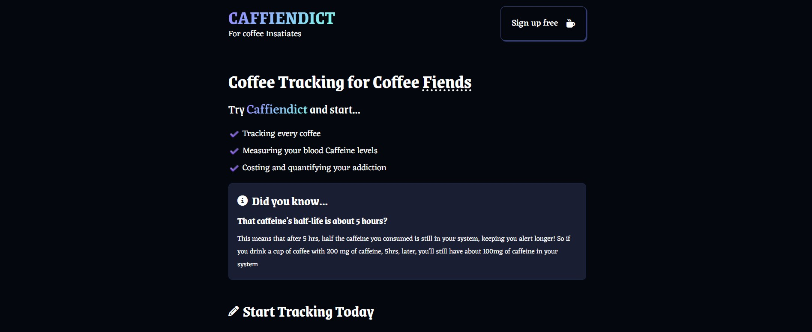

# ☕ CAFFIENDICT – For Coffee Insatiates

**Track your daily caffeine intake, estimate your current blood caffeine levels, and keep tabs on how much your coffee addiction is costing you – all in one place.**

 

## Live Demo
🔗 [Live Site URL](https://caffiendict.vercel.app/)
🧑‍💻 **Made by:** Arshal Rejith S

---

## 🚀 Features

- ✅ Track every coffee you drink with time and type
- ☕ Get real-time blood caffeine level estimates (based on a 5-hour half-life model)
- 💸 See how much you’re spending on your coffee habit
- 📈 Understand and visualize your caffeine consumption trends

---

## 🧠 The Science

> Did you know caffeine's **half-life is about 5 hours**?

This means if you drink a cup of coffee with 200mg of caffeine, **5 hours later, 100mg is still in your bloodstream**, keeping you awake and alert.

---

## 🛠️ Tech Stack

- ⚛️ **React.js** – Frontend
- 🔥 **Firebase** – Authentication & Database
- 📦 **Vite** – Development and build tool
- 🧮 Custom caffeine level calculator (based on exponential decay formula)

---
## Installation & Setup

1. **Clone the repository**:
   ```sh
   git clone https://github.com/iamarshalrejith/Caffiendict.git
   cd Caffiendict
   ```

2. **Install dependencies**:
   ```sh
   npm install
   ```

3. **Set up your .env file (for Firebase)**:
  Create a .env file in the root directory and add:
  ```env
  VITE_FIREBASE_APIKEY=your_api_key_here
  VITE_FIREBASE_AUTHDOMAIN=your_auth_domain
  VITE_FIREBASE_PROJECTID=your_project_id
  VITE_FIREBASE_STORAGEBUCKET=your_storage_bucket
  VITE_FIREBASE_MESSAGINGSENDERID=your_messaging_sender_id
  VITE_FIREBASE_APPID=your_app_id

  ```

4. **Start the development server**:
   ```sh
   npm run dev
   ```

5. **Open your browser**:
   Navigate to `http://localhost:5173/`

## 📂 Project Structure

```bash
Caffiendict/
│
├── public/
│   ├── preview.jpg
│   └── vite.svg
│
├── node_modules/
│
├── src/
│   ├── context/
│   │   └── AuthContext.jsx        # Authentication context provider
│   │
│   ├── utils/
│   │   └── index.js               # Utility functions
│   │
│   ├── components/
│   │   ├── History.jsx           # Component for displaying history
│   │   ├── Stats.jsx             # Component for statistics
│   │   ├── CoffeeForm.jsx        # Form for coffee entry
│   │   ├── Layout.jsx            # Page layout wrapper
│   │   ├── Authentication.jsx    # Login/Signup component
│   │   ├── Modal.jsx             # Reusable modal
│   │   └── Hero.jsx              # Hero section component
│   │
│   ├── assets/                   # Static assets like images, fonts, etc.
│   │
│   ├── App.jsx                   # Main application component
│   ├── main.jsx                  # App entry point
│   ├── firebase.js               # Firebase configuration
│   ├── fanta.css                 # Custom stylesheet
│   └── index.css                 # Global styles
│
├── .env                          # Environment variables
├── .gitignore                    # Git ignored files
├── index.html                    # HTML template
├── package.json                  # Project metadata and dependencies
├── package-lock.json             # Dependency lock file
├── README.md                     # Project documentation
├── vite.config.js                # Vite configuration
└── eslint.config.js              # ESLint configuration
```

## 🚀 Deployment

This project can be deployed on any static hosting service:

- **Vercel**
- **Netlify**
- **GitHub Pages**

## 📜 License

This project is licensed under the MIT License – see the [LICENSE](LICENSE) file for details.
